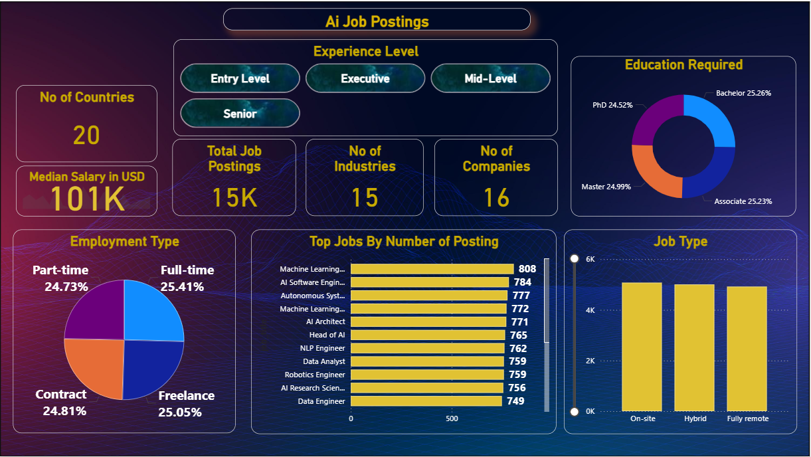
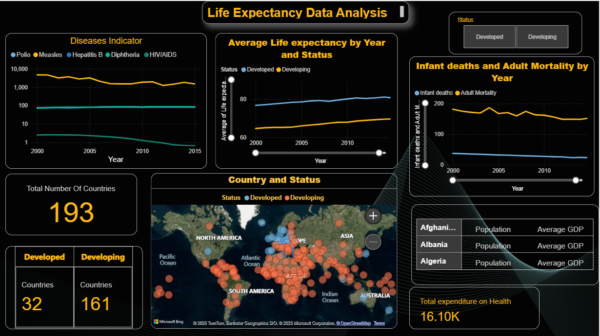
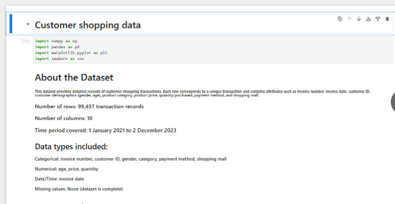

 

 

## About

Data analyst and data science student based in Peshawar, Pakistan.

I work with Python, SQL, and Power BI to explore datasets, build dashboards, and surface insights that are actionable for decision-makers. My focus is exploratory analysis, business intelligence, and clear visual communication.

Currently developing machine learning skills with Scikit-Learn — working through regression, classification, and model validation pipelines.

Actively seeking data analyst and data science roles.

---

## Skills

<table width="88%" cellpadding="14" cellspacing="0" border="0">
<tbody>

<tr bgcolor="#0F172A">
<td width="155" align="right" valign="middle"><b>Languages</b></td>
<td align="left" valign="middle">
  &nbsp;
  &nbsp;
  &nbsp;
  
</td>
</tr>

<tr bgcolor="#111827">
<td align="right" valign="middle"><b>Data Analytics</b></td>
<td align="left" valign="middle">
  &nbsp;
  &nbsp;
  
</td>
</tr>

<tr bgcolor="#0F172A">
<td align="right" valign="middle"><b>Visualization</b></td>
<td align="left" valign="middle">
  &nbsp;
  
</td>
</tr>

<tr bgcolor="#111827">
<td align="right" valign="middle"><b>Machine Learning</b></td>
<td align="left" valign="middle">
  
</td>
</tr>

<tr bgcolor="#0F172A">
<td align="right" valign="middle"><b>Web &amp; Backend</b></td>
<td align="left" valign="middle">
  &nbsp;
  &nbsp;
  &nbsp;
  
</td>
</tr>

<tr bgcolor="#111827">
<td align="right" valign="middle"><b>Developer Tools</b></td>
<td align="left" valign="middle">
  &nbsp;
  &nbsp;
  &nbsp;
  
</td>
</tr>

</tbody>
</table>

---

## Featured Projects

<table>
<tr>
<td width="50%" valign="top">

**[builtIMS](https://github.com/anascs12/builtIMS)**

**Problem** — IMSciences student developers had no shared platform to submit projects, compete on coding challenges, or collaborate on ideas.

**Built** — Full-stack web app: project showcase with voting, semester-aware coding challenges with streak tracking, faculty-judged showdowns, Hall of Fame rankings, and an ML-powered challenge generator (DistilGPT-2).

**Role** — Lead Developer

</td>
<td width="50%" valign="top">

**[AI Job Market Dashboard](https://github.com/anascs12/Ai-job-posting)**

**Problem** — How does demand for AI skills vary across roles, salaries, and geographies?

**Dataset** — 15,000+ job postings · 20 countries

**Insight** — US and EU lead on hiring volume; APAC shows accelerating salary growth for ML engineering roles. Python, SQL, and cloud platforms appear as required skills in the majority of postings.

</td>
</tr>
<tr>
<td width="50%" valign="top">

**[Life Expectancy Analysis](https://github.com/anascs12/Life-expectancy-data-analysis)**

**Problem** — Which economic and social factors explain life expectancy disparities across countries?

**Dataset** — 190+ countries · WHO multi-decade health records

**Insight** — GDP per capita and education levels predict life expectancy more strongly than healthcare expenditure in low-income nations. Built a regional comparison dashboard across all 6 WHO regions.

</td>
<td width="50%" valign="top">

**[Customer Sales Analysis](https://github.com/anascs12/Customer-sales-data)**

**Problem** — Where is revenue concentrated, and what patterns drive seasonal behaviour?

**Dataset** — Customer transaction records

**Insight** — A small subset of products drives the majority of revenue. Seasonal spikes follow consistent trailing patterns, making them predictable well in advance with basic time-series analysis.

</td>
</tr>
</table>

---

## GitHub Analytics

<table border="0" cellspacing="0" cellpadding="6">
<tr>
<td>
  
</td>
<td>
  
</td>
</tr>
</table>

---

## Activity

  

 

  <picture>
    <source media="(prefers-color-scheme: dark)"  srcset="https://raw.githubusercontent.com/anascs12/anascs12/output/github-contribution-grid-snake-dark.svg" />
    <source media="(prefers-color-scheme: light)" srcset="https://raw.githubusercontent.com/anascs12/anascs12/output/github-contribution-grid-snake.svg" />
    
  </picture>

---

## Currently Learning

- **Machine Learning** — regression, classification, model evaluation, and Scikit-Learn pipelines
- **Statistical Analysis** — hypothesis testing and probability distributions applied to real datasets
- **Advanced Data Visualization** — dashboard design principles and storytelling with data
- **End-to-End Projects** — full workflows from raw data ingestion through analysis to delivered insight

---

Thanks for visiting.

